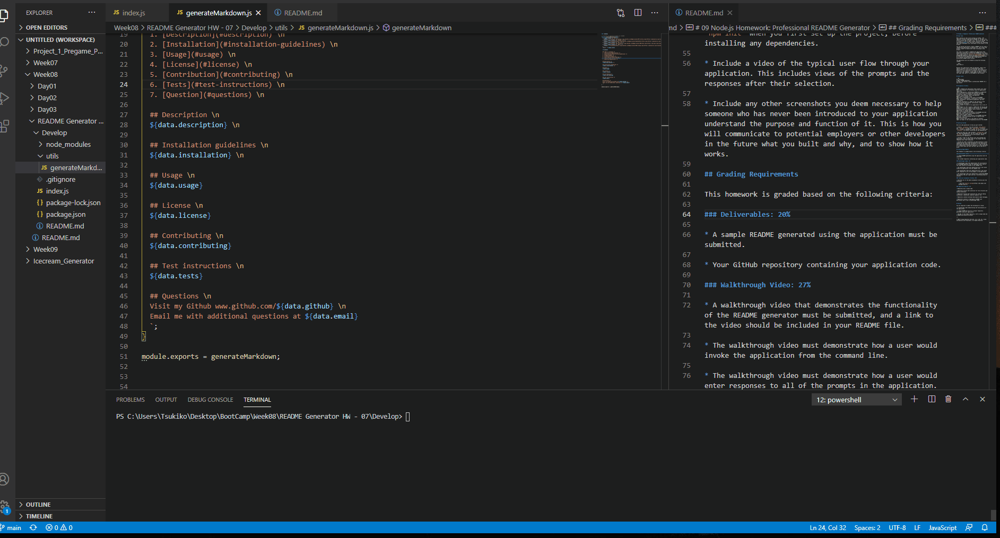

# README-Generator

  ## Table of Contents 
  1. [Description](#description) 
  2. [Installation](#installation-guidelines) 
  3. [Preview](#preview) 
  4. [Contribution](#contributing) 
  5. [Question](#questions) 

## Description

Command-line application that uses Node.js to dynamically create a README.md based on user's input.

## Installation Guidelines

1. Have Node.js installed on your machine.
2. Run `npm install` in the terminal.
3. NPM package "inquirer" required. Run `npm install inquirer` in the terminal.

## Preview
[Sample README.md](./assets/README.md)

## Contributing

To contribute clone repo locally and commit your changes on a separate branch.

## Questions

